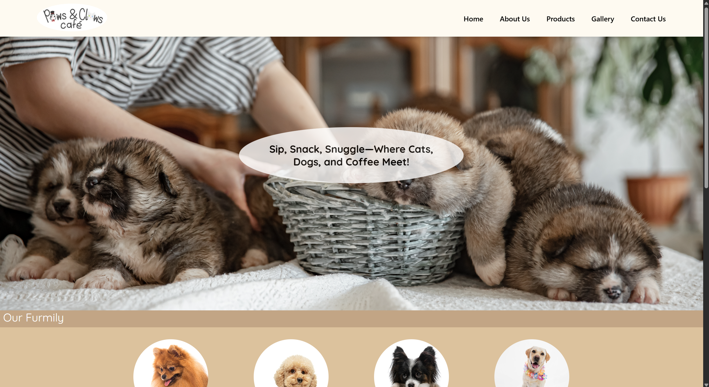
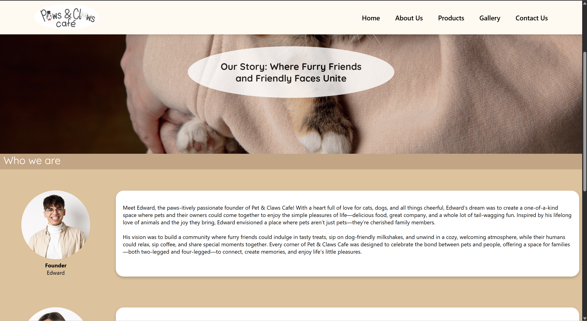
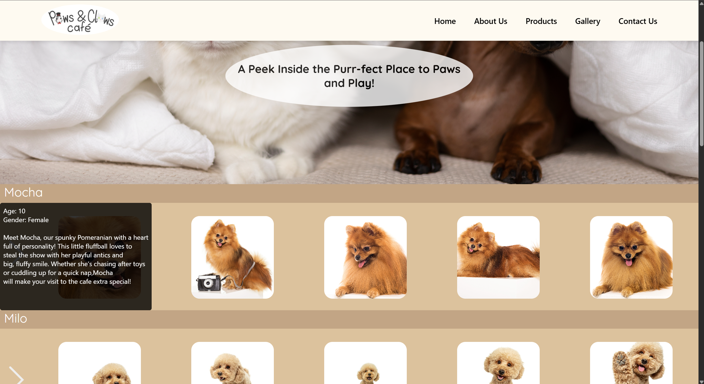
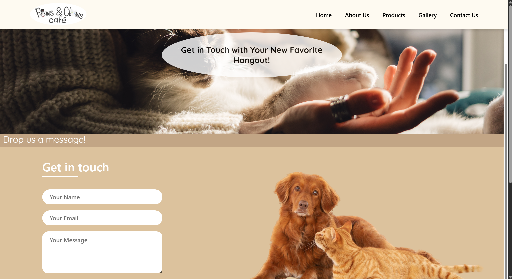

# 🌐 Website Design Project – "Paws & Claws Cafe"

Welcome to my website project created for one of my **school assignments** where we were asked to conceptualize and design a complete website using Dreamweaver.

This project is called **Paws&Claws Cafe** — a fictional dog & cat cafe with its own logo to strengthen brand identity. It was a fun blend of design creativity and technical layout planning!

---

## ✒️ Logo Design

I created the **Paws & Claws Cafe** logo using **Adobe XD**.  

---

## 🏠 Home Page (`home.html`)

This is the landing page that sets the tone for the entire site.  
_(Insert screenshot below)_

---

## 📘 About Us Page (`aboutus.html`)

Here I explain the fictional purpose of Police Eyes and the team behind it.  
_(Insert screenshot below)_

---

## 🖼️ Gallery Page (`gallery.html`)

Image showcases with sleek layout and visual cohesion.  
_(Insert screenshot below)_

---

## 🛍️ Products Page (`products.html`)

Imaginary offerings for our kiosk technology concept.  
_(Insert screenshot below)_

---

## 📞 Contact Us Page (`contactus.html`)

Basic form layout for visitors to reach out.  
_(Insert screenshot below)_

---

## 🙏 Thank You for Visiting!

Thank you for viewing my project!  
I really enjoyed working on this — both the creative and technical aspects — and I hope you enjoyed browsing it as much as I enjoyed building it.
